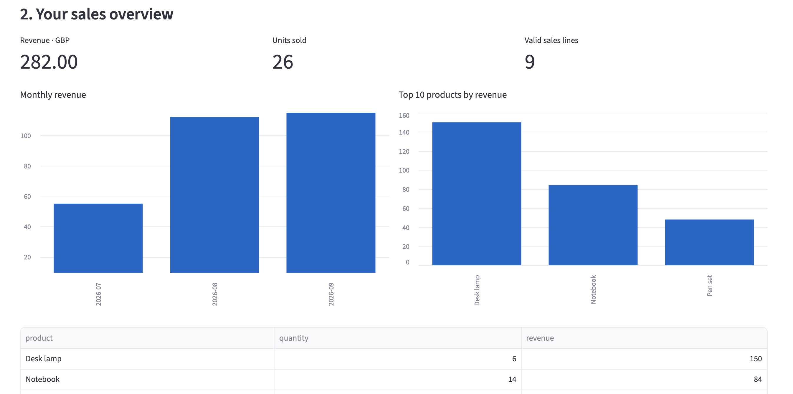

# Sales Snapshot

A beginner-friendly, local sales CSV reporting app built with Python and Streamlit. Use it as a portfolio project and a starting point for paid customisation. No AI API key or paid subscription is needed.
## Dashboard preview


## What it does

- Maps your CSV columns to date, product, quantity and line revenue.
- Shows total revenue, units sold, monthly revenue and product rankings.
- Excludes invalid rows and lets you download them for review.
- Exports clean data and summaries as CSV.
- Generates a printable HTML report. Open it in a browser and use Print → Save as PDF.
- Includes fictional sample data so you can try it immediately.

## Start on a Mac: copy one line at a time

1. Extract the ZIP in Downloads. Open Terminal.
2. Enter the extracted project folder. If its location differs, type `cd ` and drag the folder from Finder into Terminal, then press Enter.

```bash
cd ~/Downloads/sales-report-starter
python3 -m venv .venv
source .venv/bin/activate
python -m pip install -r requirements.txt
python -m streamlit run app.py
```

Use Python 3.10 or later. If Terminal cannot find python3, install Python first. Installation needs internet access; normal local app use does not. A browser window should open; otherwise open the localhost address printed in Terminal. Stop the app with Control+C.

Next time:

```bash
cd ~/Downloads/sales-report-starter
source .venv/bin/activate
python -m streamlit run app.py
```

First try the sample without uploading a file. Expected results: revenue 282, units 26, 9 sales lines. Monthly revenue: July 55, August 112, September 115. Desk lamp is the leading product by revenue.

## Your CSV

Example:

```csv
date,product,quantity,revenue
2026-10-01,Notebook,2,12
2026-10-02,Desk lamp,1,25
```

Revenue is the total for the line: two notebooks at 6 each means revenue 12, not 6. Use a single currency and plain numeric values without currency signs or thousands separators. ISO dates (YYYY-MM-DD) avoid ambiguous date formats. Quantity must be a non-negative integer. The app does not infer tax treatment, calculate profit, or perform currency conversion. Negative refund lines are excluded; this starter is not a net-sales accounting tool. Duplicate-looking lines remain because they may represent legitimate repeat sales. There is no order identifier, so sales lines cannot be interpreted as orders.

Local processing is performed on your computer. Hosting this app remotely changes that: uploads reach the server. Do not publish real customer files on GitHub. The app does not intentionally save uploaded data to disk, but operating-system/browser behaviour is outside its control.

## Put it on GitHub without using Git commands

1. Sign in to GitHub, create a new repository named `sales-snapshot`.
2. Choose Public if you want a portfolio demo. Do not upload customer data.
3. Open the repository and choose Add file → Upload files (the initial empty-repository screen also offers an upload link).
4. Upload the contents of this project folder, not the ZIP. Include README.md, app.py, core.py, requirements.txt, sample_sales.csv, test_core.py, LICENSE and BUSINESS_PLAN.md. Include .gitignore if your file picker shows it.
5. Commit the uploaded files. Never upload .venv or __pycache__.
6. Check that README.md appears on the repository homepage.

GitHub stores the code; it does not automatically run this Python app or pay you for downloads. GitHub Pages cannot run its Python backend. Start locally first. Remote hosting and payments are separate future steps.

## Earning model

Publish this free MIT-licensed starter and sell your work adapting it to a customer's data. People can already use the starter freely; charge for a concrete service, convenience and support rather than suggesting they must pay to use the public code. See BUSINESS_PLAN.md. No payment integration or guaranteed customers are included.

## Tests

```bash
python -m unittest discover -v
```

## 中文快速说明

这是一个本地运行的销售 CSV 分析工具，不需要 AI API 或付费 AI 订阅。先解压 ZIP，在终端进入文件夹，然后按照上面的五行命令逐行运行。第一次不用上传文件，直接查看虚构示例数据。

客户提供销售 CSV，你可以帮助其适配列名、验证数据并定制报表。收费的是你的定制与服务。GitHub 不会因为下载量而给你付钱。本项目不含收款功能，也不保证订单或收入。

收入列必须是每行销售总额，不是单价；不能混合币种。退款等负数行会被排除，因此不能用于计算包含退款的净销售额。不要把真实客户数据上传到 GitHub。
